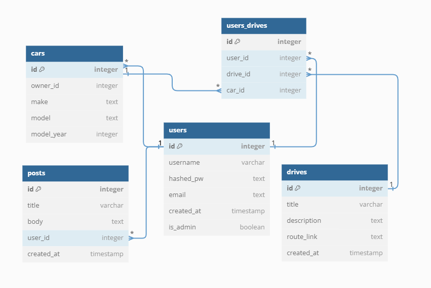

# Two Lanes!

For this project I used React and Node, I created a backend/db to hold user data and map routes. the focus of this project is to make a well functioning Road trip website that users can log in to, get a route, and add/remove from "MyGarage" under their username, view other peoples "Garages", as well as comment on the selected Route page.

The goal is to create a website that me and others can use to organize fun road trips, plan stops, and later on add routes and photos.

This is a road tripping organization website built for people who have a close friend group, or even want to meet new friends and go on adventures together!

The data I plan on using is getting custom routes from any Maps provider,(initially supporting Google Maps) by building a custom API to communicate with my DB as well as eventually get routes from Maps and Weather API's

The database will have a few tables, making functionality for a user to save a vehicle to the Garage table, leave some posts, and join drives. 

*You can visit the site TwoLanes!*

*Try it for yourself at:* https://two-lanes.onrender.com

## Database Layout:

## Features:
    -User profile with edit form,
    -Ability to create a Post that others can see, and the delete button only shows up for users who created 
        that post OR an administrator.
    -Ability to store cars in "My Garage", and use that garage to join drives
    -Ability to Join drives, get Routes for a drive, and see who else is going on that drive

## API:
    I created my own API to interact with a database that I designed. setting routes and passing data as 
    JSON. As well as using custom JSON schema validators to ensure data was being passed correctly.

## Flow:
    Users will sign up or log in, check any drives or posts they may have interest in, 
    add or remove from their garage, change their name or email, and Join, Leave and get the 
    Route for a drive.

## Tech:
    React
    Node
    Postgres
    jsonwebtokens
    jsonschema
    bcrypt
    axios

## For the Future:
    -I would like to add a photo for any cars a user has, profile photos
    -I would like to add comments on Posts, possibly on Drives for any suggestions people may have.
    -I would like to add a search bar to search for users, as well as make every username clickable on 
        posts/drives that would take you to that persons profile
    -I would like to add a boolean for Profile Privacy so that if you don't want people seeing certain 
        data on your profile then you can protect it.

