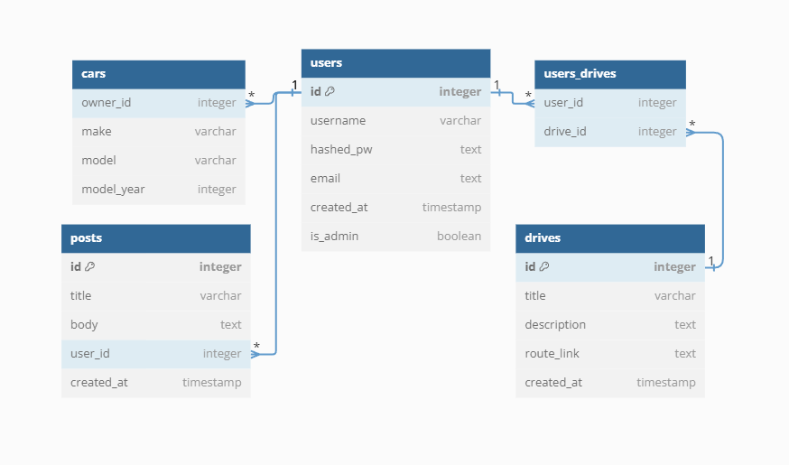

For this project I will be using React and Node, I will create a backend/db to hold user data, map routes, and comments. the focus of this project is to make a well functioning Road trip website that users can log in to, get a route, and add/remove from "MyGarage" under their username, view other peoples "Garages", as well as comment on the selected Route page.

The goal is to create a website that me and others can use to organize fun road trips, plan stops, and later on add routes and photos.

This is a road tripping organization website built for people who have a close friend group, or even want to meet new friends and go on adventures together!

The data I plan on using is getting custom routes from any Maps provider,(initially supporting Google Maps) by building a custom API to communicate with my DB as well as eventually get routes from Maps and Weather API's

The database will have a few tables, making functionality for a user to save a vehicle to the Garage table, leave some posts, and join drives. 

User flow would be to login, (eventually I would like to save a token to localStorage or Cookies for a "remember me" function) and after logging in a list of trips/drives would be on the screen, where they can select a trip/drive and can join it. As well as later on "check in" at a stop, leave a comment, or Complete the trip.

Database Layout:

